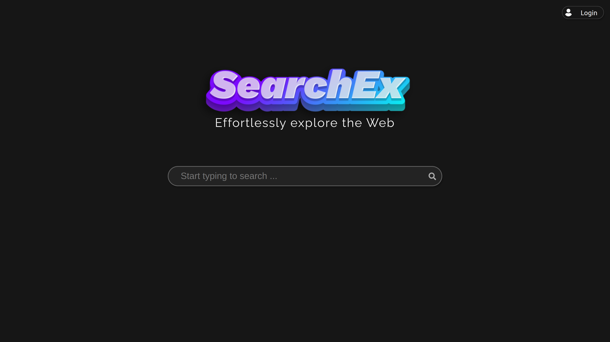
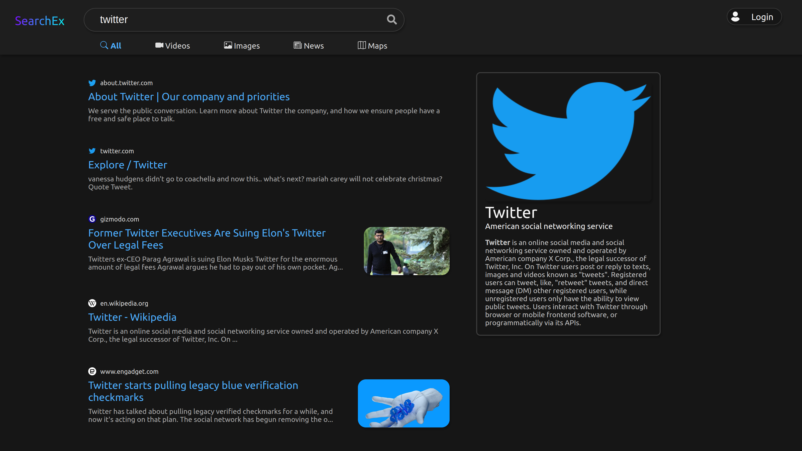
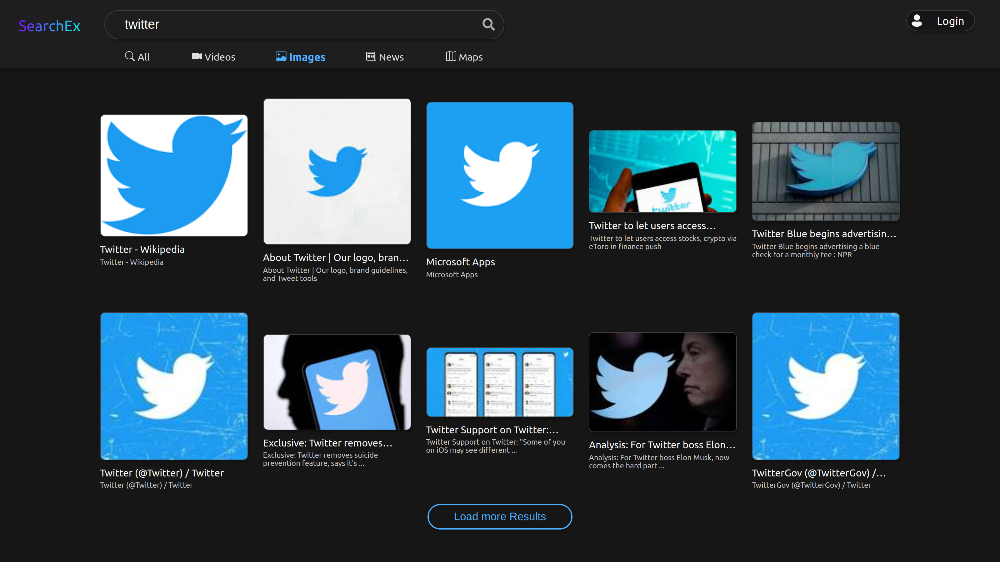

This is a [Next.js](https://nextjs.org/) project bootstrapped with [`create-next-app`](https://github.com/vercel/next.js/tree/canary/packages/create-next-app).
SearchEx is a search engine clone built with Next.js 13 (beta dir). It utilizes Google Custom Search API and other APIs to provide users with search results. Users can log in and log out using Next-Auth for authentication.

## Features
* Clean UI
* Search for web pages, images, news, and videos
* View search history and saved searches
* Sign up, log in, and log out
* Support for multiple authentication providers (e.g. Google, GitHub)
* Pagination system at the bottom of the search page
* Open AI for Card
* Light & dark Theme

## Getting Started

To get started with this project, you can simply clone this repository and install the necessary dependencies.

```bash
git clone https://github.com/devxprite/searchex.git
cd searchex
npm install
```

### Configuration
Before running the project, make sure to set up the environment variables in a .env file located in the root directory of the project. Below is a sample .env file:
```
GOOGLE_API_KEY=
GOOGLE_API_CX=

YOUTUBE_API_KEY=

NEWS_API_KEY=
OPENAI_API_KEY=

NEXTAUTH_URL=
NEXTAUTH_SECRET=

GITHUB_ID=
GITHUB_SECRET=

AUTH0_ISSUER_BASE_URL
AUTH0_CLIENT_ID
AUTH0_CLIENT_SECRET=

MONGODB_USERNAME=
MONGODB_PASSWORD=
MONGODB_HOST=
MONGODB_DB=
```

### Running the Project

Once you have set up the environment variables, you can start the development server with the following command:
```bash
npm run dev
```
This will start the Next.js development server at http://localhost:3000.  
The website auto-updates as you edit the file.

The `pages/api` directory is mapped to `/api/*`. Files in this directory are treated as [API routes](https://nextjs.org/docs/api-routes/introduction) instead of React pages.

## Screenshots






## License
This project is licensed under the MIT License.

## Learn More

To learn more about Next.js, take a look at the following resources:

- [Next.js Documentation](https://nextjs.org/docs) - learn about Next.js features and API.
- [Learn Next.js](https://nextjs.org/learn) - an interactive Next.js tutorial.